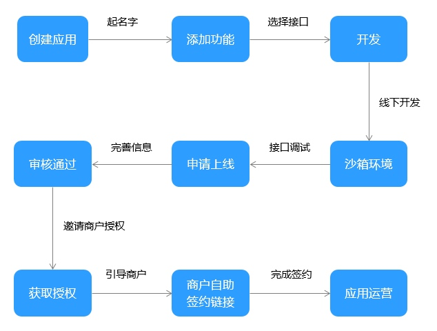
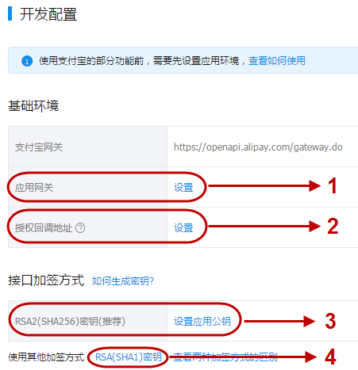
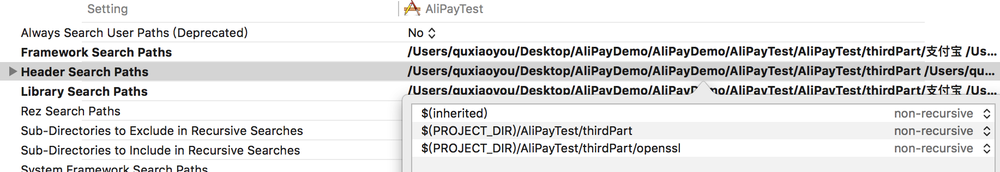
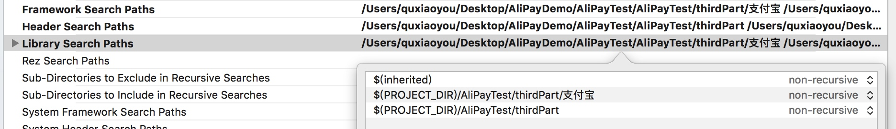
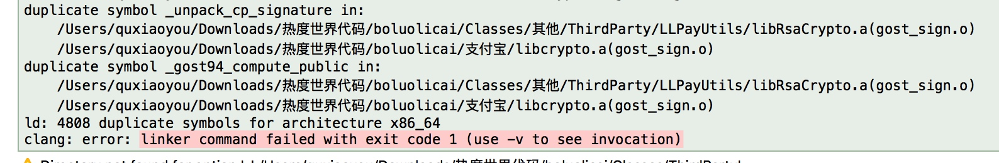

# AliPayDemo

集成支付宝Demo，供坑里人解决问题查看

[官方开发指南](https://docs.open.alipay.com/399/106917/)

> 本文记录了我使用支付宝的一些过程
> 第一部分是一些我根据官方文档中摘录的可用的重要信息
> 第二部分是整理的 iOS/Android App 接入主要流程 && Demo
> 第三部分是遇到的几个坑，比较重要，**特别记录一下**

第一部分

----

## 应用创建及使用流程：

### 1.创建应用

开发者使用支付宝账号登录开放平台（**需实名认证的支付宝账号**），根据实际需求创建应用（如“支付应用”）。
**备注：创建应用时的应用状态为“开发中”，无法在线上正式调用接口。如您已经了解应用的基本功能，可点击此处跳过此步骤；**

### 2.填写应用基础信息

名称 && 图标 将来会作为审核依据，[审核规则](https://render.alipay.com/p/f/fd-ir3b1iwo/index.html)

### 3. 配置应用环境

字段名称        |   字段描述
------------   |   -------------
应用网关 对应下图1 | 用于接收支付宝异步通知，例如口碑开店中， 需要配置此网关来接收[开发者门店被动通知](https://docs.open.alipay.com/205/105251#s1)
授权回调地址 对应下图2 | 第三方授权或用户信息授权后回调地址。 授权链接中配置的redirect_uri的值必须与此值保持一致。 (如：https://www.alipay.com) 注：当填入该地址时，系统会自动进行安全检测， 详情请参考[安全检测](https://docs.open.alipay.com/316/106274)。
RSA(SHA256)密钥 （对应下图3） | 开发者要保证接口中使用的私钥与此处的公钥匹配， 否则无法调用接口。可参考密钥的生[成与配置](https://docs.open.alipay.com/291/105971)，且接口参数sign_type=RSA2。
RSA(SHA1)密钥 （对应下图4） | 同上，且接口参数sign_type=RSA。

**UI 页面参考**

**签名与生成密钥**

如何生成与配置密钥详见[签名专区](https://docs.open.alipay.com/291/105971)。 
TIPS：必须填写“接口加密方式”（加密方式只需填写一个），才可以提交审核。

### 4.接入沙箱环境

开发中的应用无法调用线上正式环境的接口，蚂蚁提供了沙箱环境帮助开发者进行开发调通工作，沙箱环境自动为开发者分配沙箱应用，不依赖线上环境的应用创建；
点击“开放平台-开发者中心-[沙箱环境](https://openhome.alipay.com/platform/appDaily.htm)”。进入沙箱环境页面，系统已经自动为你创建一个应用。与线上流程一致，只要配置了沙箱应用的密钥即可开始开发。

## 应用安全性开发指南

[《开放平台第三方应用安全开发指南》](https://docs.open.alipay.com/399/106918/)给出常见开发场景下，帮助开发人员完善应用安全性的开发建议，同时也对常见的安全漏洞进行描述，并提供对应的修复方案。

## 各种官方Demo下载

各种版本Demo体验与下载 <https://docs.open.alipay.com/399/106844/>

## 开发上线指南

上线和使用指南<https://docs.open.alipay.com/399/106853/>

  
 第二部分 

----

## [iOS端接入指南](https://docs.open.alipay.com/204/105295/) 
## [Android端接入指南](https://docs.open.alipay.com/204/105296/)

  
 第三部分 

----

## 遇到的坑和解决

这部分是集成Demo过程中主要遇到的三个问题解决，下面是我解决的方法，希望能帮到有缘人

- 集成支付宝 报错 “openssl/asn1.h file not found”
- 集成支付宝 报错 “library not found for -xxx”
- 集成支付宝 报错 "duplicate symbol _base64_encode"

下面分别说一下这三个问题

### 1.集成支付宝 报错 “openssl/asn1.h file not found”

这个问题应该是最常见的问题，官方文档中也说了是查找头文件路径问题，解决方案如下:
**点击项目名称，点击“Build Settings”选项卡，在搜索框中，以关键字“search”搜索，对“Header Search Paths”增加头文件路径：$(SRCROOT)/项目名称。如果头文件信息已增加，可不必再增加。**

**这里着重说一下原理**

Build Setting 下面 Search 主要分三个类型

- Framework Search Paths
- Header Search Paths
- Library Search Paths

这三个类别在官方文档里解释很清楚(如图)

- Framework Search Paths

在编译C、Objective-C、c++或objective - c++，以及产品使用的框架的链接器时，这是一个目录列表，其中包含了包含或导入头文件的编译器的目录。路径是由空格分隔的，因此任何带有空格的路径都必须正确引用。

- Header Search Paths

这是在编译C、Objective-C、c++或objective - c++时，编译器要搜索的文件夹的路径列表。路径是由空格分隔的，因此任何带有空格的路径都需要正确引用。

- Library Search Paths

这是一个目录列表，用于为该产品使用的库进行链接搜索。路径是由空格分隔的，因此任何带有空格的路径都需要正确引用。

**小结**
**懂了原理就变的很清楚了，找不到文件实际上就是我们的路径没有配置正确**

- 路径可以根据我们的项目分层自己设置，相应的路径配置也要配置正确
- 经测试，openssl文件夹，Utils文件夹，和支付宝SDK的文件夹要配置在同一级
- Framework Search Paths 和 Library Search Paths 是编译器和连接器找库和头文件的路径，配置内容是一致的
- 支付宝SDK的文件夹内部文件可以放一起，Header Search Paths 配置中只需要找到对应文件夹上一级即可

最终配置方式：

### 2.集成支付宝 报错 “library not found for -xxx”

这个问题就是上面说的 Library Search Paths 配置问题。
原因就是项目中使用的第三方库，Xcode找不到对应的静态库，根据上面原理配置即可

### 3.集成支付宝 报错 "duplicate symbol _xxxxxx"

这个问题是我项目中在集成支付宝的同时也有其他的支付相关库，仔细看报错会发现其中有两个路径。一个是支付宝下面 libcrypto.a 一个LLPayUtils下的libRsaCrypto.a 两者在编译过程中生成了同样的连接符号 gost_sign.o 导致连接器在连接过程中无法正确连接。

实际上就是两个库中都定义了 gost_sign.m 这样的源文件，文件内部有符号`_unpack_cp_signature` 和 `_gost94_compute_public` 等等

**解决办法**

1. 如果是自己写的文件直接修改内部符号
2. 如果是三方静态库自己看不了实现，就删除一个吧（欢迎补充更好的方法）

**小结**

1. 支付宝有些坑，但是如果懂原理，其实是很好解决的。要多学习

最后献上一个自己集成的小Demo欢迎下载查看
[支付宝集成Demo:https://github.com/xiaoyouPrince/AliPayDemo](https://github.com/xiaoyouPrince/AliPayDemo)

